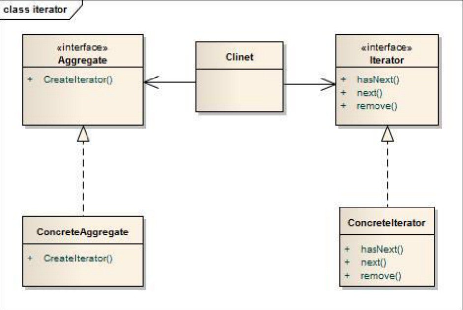

Caso de Estudio 3
---

Estudiante: Yerlin Leal

<h4>Figura 1: Diagrama UML diseño Iterator</h4>

Fuente: 

 

## Referencias bibliográficas
[1] S. Jiang and H. Mu, "Design patterns in object oriented analysis and design," 2011 IEEE 2nd International Conference on Software Engineering and Service Science, 2011, pp. 326-329, doi: 10.1109/ICSESS.2011.5982229.